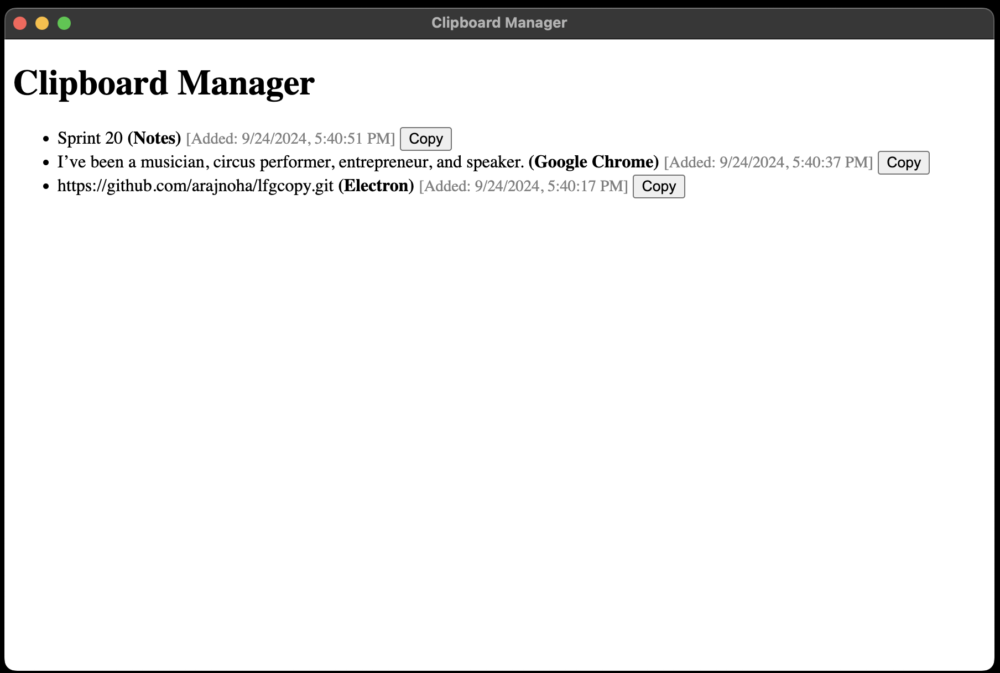

### Kickoff of a simple clipboard manager

It simply copies everything that goes into system clipboard here as well and records the app it comes from, as well as the time, in an ordered list.

This is an alpha version without any keyboard shortcuts, highlights or UI, really, as a proof-of-concept.

### Install
- clone the repo
- `npm install`
- `npm start`

### Screenshot

